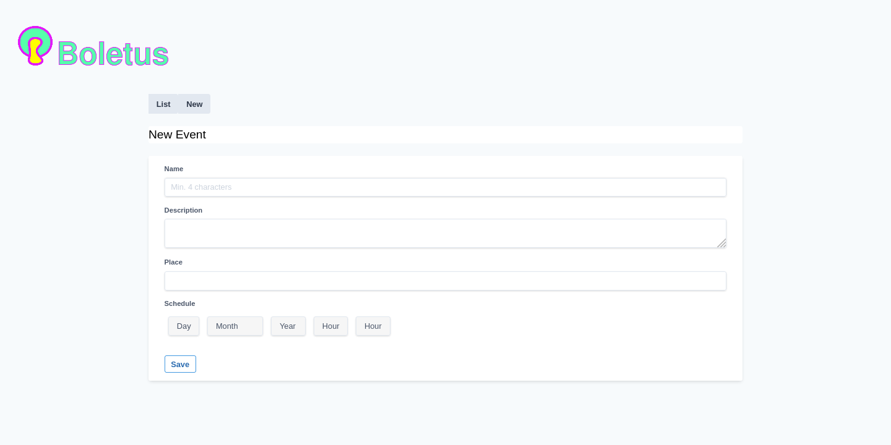

### Etymology 1

Borrowed from Latin bōlētus, from Ancient Greek βωλίτης (bōlítēs).
Noun

#### boleto m (plural boletos)

  * porcini (Boletus edulis, an edible mushroom)
    (in general) any bolete mushroom

### Etymology 2

Borrowed from Spanish boleta or Italian bolletta, from Latin bulla.
Noun

#### boleto m (plural boletos)

  * ticket

## Features

  * List events
  * Ticket summary by events
  * Pre booking
  * Ticket purchasing

## Screenshots



[More](docs/screenshots.md)


## App Description

  [More info](docs/description.md)

## Dev. Env. Setup

### Clone app

```shell
$ git clone https://gitlab.com/adrianpk/boletus
```

### Create database user

If it does not exist yet.

```shell
$ psql
psql (11.5 (Ubuntu 11.5-1))
Type "help" for help.

user=# CREATE ROLE boletus;
user=# ALTER USER boletus WITH PASSWORD 'boletus';
```

Replace rolename by the database user owner.
Replace password by prefered password.

### Create database

```shell
user=# CREATE DATABASE boletus_dev OWNER boletus;
user=# CREATE DATABASE boletus_test OWNER boletus;
```

### Update run.sh script

Edit `scripts/run.sh`

Update values according to the preferred ones and / or those of your system.

### Run app

```shell
$ make clean-and-run
```

**You should see something like this**

```shell
2:56PM INF Cookie store key value=iVuOOv4PNBnqTk2o13JsBMOPcPAe4p18
2:56PM INF Reading template path=event/_ctxbar.tmpl
2:56PM INF Reading template path=event/_flash.tmpl
2:56PM INF Reading template path=event/_form.tmpl
2:56PM INF Reading template path=event/_header.tmpl
2:56PM INF Reading template path=event/_item.tmpl
2:56PM INF Reading template path=event/_list.tmpl
2:56PM INF Reading template path=event/edit.tmpl
2:56PM INF Reading template path=event/index.tmpl
2:56PM INF Reading template path=event/initdel.tmpl
2:56PM INF Reading template path=event/new.tmpl
2:56PM INF Reading template path=event/show.tmpl
2:56PM INF Reading template path=layout/base.tmpl
2:56PM INF Reading template path=user/_ctxbar.tmpl
2:56PM INF Reading template path=user/_flash.tmpl
2:56PM INF Reading template path=user/_form.tmpl
2:56PM INF Reading template path=user/_header.tmpl
2:56PM INF Reading template path=user/_item.tmpl
2:56PM INF Reading template path=user/_list.tmpl
2:56PM INF Reading template path=user/_signin.tmpl
2:56PM INF Reading template path=user/_signup.tmpl
2:56PM INF Reading template path=user/edit.tmpl
2:56PM INF Reading template path=user/index.tmpl
2:56PM INF Reading template path=user/initdel.tmpl
2:56PM INF Reading template path=user/new.tmpl
2:56PM INF Reading template path=user/show.tmpl
2:56PM INF Reading template path=user/signin.tmpl
2:56PM INF Reading template path=user/signup.tmpl
2:56PM INF Parsed template set path=event/edit.tmpl
2:56PM INF Parsed template set path=event/index.tmpl
2:56PM INF Parsed template set path=event/new.tmpl
2:56PM INF Parsed template set path=event/show.tmpl
2:56PM INF Parsed template set path=event/initdel.tmpl
2:56PM INF Parsed template set path=user/new.tmpl
2:56PM INF Parsed template set path=user/index.tmpl
2:56PM INF Parsed template set path=user/signup.tmpl
2:56PM INF Parsed template set path=user/edit.tmpl
2:56PM INF Parsed template set path=user/initdel.tmpl
2:56PM INF Parsed template set path=user/show.tmpl
2:56PM INF Parsed template set path=user/signin.tmpl
2:56PM INF Dialing to Postgres host="host=localhost port=5432 user=boletus password=boletus dbname=boletus_dev sslmode=disable"
2:56PM INF Postgres connection established
2:56PM INF New migrator name=migrator
2:56PM INF New seeder name=seeder
2:56PM INF New handler name=mailer
2020/01/19 14:56:14 CreateUsersTable
2020/01/19 14:56:14 Migration executed: CreateUsersTable
2020/01/19 14:56:14 CreateEventsTable
2020/01/19 14:56:14 Migration executed: CreateEventsTable
2020/01/19 14:56:14 CreateTicketsTable
2020/01/19 14:56:14 Migration executed: CreateTicketsTable
2020/01/19 14:56:14 Seed step executed: Users
2020/01/19 14:56:14 Seed step executed: EventAndTickets
2:56PM INF Scheduler started
2:56PM INF gRPC server initializing port=:8082
2:56PM INF Web server initializing port=:8080
2:56PM INF Currency rates updated base=EUR date=2020-01-17
2:57PM INF Expire tickets process init.
2:57PM INF Ticket reservation expired count=0
2:58PM INF Expire tickets process init.
2:58PM INF Ticket reservation expired count=4
```

## Make commands

A brief summary of the most used commands

**make build**

Builds the application

**make run**

Run the application hrough a shell script that previously sets the environment variables with required values.
The shell script can be found in `scripts/run.sh`.

**make test**

Run tests

**make grc-test**

Run tests with coloured output. [grc](https://github.com/garabik/grc) needs to be available in your system.

**package-resources**

It generates a binary representation for html templates, translations and other resources that allows it to embed them within the compiled file. `clean-and-run` runs this make task as subtask before starting the applicacion.

**build-stg**

Build a staging Docker image of this application and pushes it to Docker Hub.

**build-prod**

Same as `make build-stage` but for production images.

**build-client**

Build the gRPC client. Source files location is `cmd/client/client.go` and compiled target is `bin/client`.

**install-stg**

Deploys app to Googke GKE usando [HELM](https://helm.sh/).
I haven't created helm .yaml files yet, so this command is not functional yet.

**install-prod**

Same as `make install-stage` but for production images.

**gen-proto**

Updates go files with changes in API made in the pprotocol buffers definition file at `pkg/grpc/api/v1`.

**make client**

Compiles the client and launches it through a shell script `scripts/client.sh` who sets some environment values required to use it.

## Client

Now it is mostly used for manual testing but some flag based configuration will be implemented to make its use more ergonomic.

```go
const(
	// select slug from users;
	userSlug = "lauriem-000000000004"

	// select slug from events;
	eventSlug = "rockpartyinwrocław-000000000001"

	// PreBook ticket type [normal, golden-circle, silver-circle, bronce-circle, couple]
	ticketType = "standard"
	//ticketType = "golden-circle"
	//ticketType = "couples"
	//ticketType = "preemptive"

	// replace by a a valid reservation ID
	reservationID = "cab86283242c"
)
```

And also enable the comment / uncomment to enable the function you want to invoke.

```go
	// IndexEvents
	log.Info("IndexEvents begin")
	clt.IndexEvents()
	log.Info("IndexEvents end\n")

	// Ticket summary
	log.Info("TicketSummary begin")
	clt.EventTicketSummary()
	log.Info("TicketSummary end\n")

	// PreBook
	log.Info("PreBook begin")
	clt.PreBook()
	log.Info("PreBook end\n")

	// ConfirmBooking
	log.Info("ConfirmBooking begin")
	clt.ConfirmBooking()
	log.Info("ConfirmBooking end\n")
```

Then `make client`

```shell
$ make client
./scripts/client.sh
6:31PM INF Dialing gRPC server address=localhost:8082

6:31PM INF IndexEvents begin
6:31PM INF (*v1.IndexEventsRes)(0xc0000c2af0)(api:"v1" events:<slug:"rockpartyinwroc\305\202aw-000000000001" name:"Rock Party in Wroc\305\202aw" description:"Make some noise!" place:"Wroc\305\202aw Stadion Miejski" scheduledAt:"0001-01-01T00:00:00Z" > )
6:31PM INF IndexEvents end

6:31PM INF TicketSummary begin
6:31PM INF (*v1.TicketSummaryListRes)(0xc0000c3720)(api:"v1" list:<eventSlug:"rockpartyinwroc\305\202aw-000000000001" type:"couples" qty:39 price:20 currency:"EUR" prices:<key:"CZK" value:502.94 > prices:<key:"EUR" value:20 > prices:<key:"PLN" value:84.734 > prices:<key:"RUB" value:1364.99 > prices:<key:"USD" value:22.216 > > list:<eventSlug:"rockpartyinwroc\305\202aw-000000000001" type:"preemptive" qty:40 price:30 currency:"EUR" prices:<key:"CZK" value:754.41 > prices:<key:"EUR" value:30 > prices:<key:"PLN" value:127.101 > prices:<key:"RUB" value:2047.485 > prices:<key:"USD" value:33.324 > > list:<eventSlug:"rockpartyinwroc\305\202aw-000000000001" type:"standard" qty:500 price:30 currency:"EUR" prices:<key:"CZK" value:754.41 > prices:<key:"EUR" value:30 > prices:<key:"PLN" value:127.101 > prices:<key:"RUB" value:2047.485 > prices:<key:"USD" value:33.324 > > list:<eventSlug:"rockpartyinwroc\305\202aw-000000000001" type:"golden-circle" qty:20 price:75 currency:"EUR" prices:<key:"CZK" value:1886.025 > prices:<key:"EUR" value:75 > prices:<key:"PLN" value:317.7525 > prices:<key:"RUB" value:5118.7124 > prices:<key:"USD" value:83.31 > > )
6:31PM INF TicketSummary end

6:31PM INF PreBook begin
6:31PM INF (*v1.TicketOpRes)(0xc00010ca00)(api:"v1" list:<name:"Rock Party in Wroc\305\202aw" eventSlug:"8b4e01c7-5b14-48f8-8537-9936df0446dc" type:"standard" serie:"A" number:280 seat:"0001-01-01 00:00:00Z" price:30000 currency:"EUR" reservationID:"5282d8e45b72" status:"reserved" > list:<name:"Rock Party in Wroc\305\202aw" eventSlug:"8b4e01c7-5b14-48f8-8537-9936df0446dc" type:"standard" serie:"A" number:44 seat:"0001-01-01 00:00:00Z" price:30000 currency:"EUR" reservationID:"5282d8e45b72" status:"reserved" > list:<name:"Rock Party in Wroc\305\202aw" eventSlug:"8b4e01c7-5b14-48f8-8537-9936df0446dc" type:"standard" serie:"A" number:274 seat:"0001-01-01 00:00:00Z" price:30000 currency:"EUR" reservationID:"5282d8e45b72" status:"reserved" > list:<name:"Rock Party in Wroc\305\202aw" eventSlug:"8b4e01c7-5b14-48f8-8537-9936df0446dc" type:"standard" serie:"A" number:230 seat:"0001-01-01 00:00:00Z" price:30000 currency:"EUR" reservationID:"5282d8e45b72" status:"reserved" > total:120 currency:"EUR" reservationID:"5282d8e45b72" status:"reserved" )
6:31PM INF PreBook end

6:31PM INF ConfirmBooking begin
6:31PM INF (*v1.TicketOpRes)(0xc0002a4380)(api:"v1" list:<name:"Rock Party in Wroc\305\202aw" eventSlug:"8b4e01c7-5b14-48f8-8537-9936df0446dc" type:"standard" serie:"A" number:32 seat:"0001-01-01 00:00:00Z" price:30000 currency:"EUR" reservationID:"2f28927a4d71" status:"paid" > list:<name:"Rock Party in Wroc\305\202aw" eventSlug:"8b4e01c7-5b14-48f8-8537-9936df0446dc" type:"standard" serie:"A" number:296 seat:"0001-01-01 00:00:00Z" price:30000 currency:"EUR" reservationID:"2f28927a4d71" status:"paid" > list:<name:"Rock Party in Wroc\305\202aw" eventSlug:"8b4e01c7-5b14-48f8-8537-9936df0446dc" type:"standard" serie:"A" number:205 seat:"0001-01-01 00:00:00Z" price:30000 currency:"EUR" reservationID:"2f28927a4d71" status:"paid" > list:<name:"Rock Party in Wroc\305\202aw" eventSlug:"8b4e01c7-5b14-48f8-8537-9936df0446dc" type:"standard" serie:"A" number:45 seat:"0001-01-01 00:00:00Z" price:30000 currency:"EUR" reservationID:"2f28927a4d71" status:"paid" > total:120 currency:"EUR" reservationID:"2f28927a4d71" status:"paid" )
6:31PM INF ConfirmBooking end
```

## Tests

```shell
$ make test

go test -v -run TestTicketSummary -count=1 -timeout=5s  ./internal/app/svc/ticketsvc_test.go
=== RUN   TestTicketSummary
11:33PM INF Currency rates updated base=EUR date=2020-01-20
--- PASS: TestTicketSummary (0.16s)
PASS
ok  	command-line-arguments	0.870s

go test -v -run TestPreBookStandardTickets -count=1 -timeout=5s  ./internal/app/svc/ticketsvc_test.go
=== RUN   TestPreBookStandardTickets
11:33PM INF Currency rates updated base=EUR date=2020-01-20
--- PASS: TestPreBookStandardTickets (0.20s)
PASS
ok  	command-line-arguments	0.896s

go test -v -run TestPreBookGoldenCircleTickets -count=1 -timeout=5s  ./internal/app/svc/ticketsvc_test.go
11:33PM INF New migrator name=migrator
=== RUN   TestPreBookGoldenCircleTickets
11:33PM INF Currency rates updated base=EUR date=2020-01-20
--- PASS: TestPreBookGoldenCircleTickets (0.23s)
PASS
ok  	command-line-arguments	0.906s

(...)
```

## Notes

* [To do list](docs/gtd/gtd.md)
