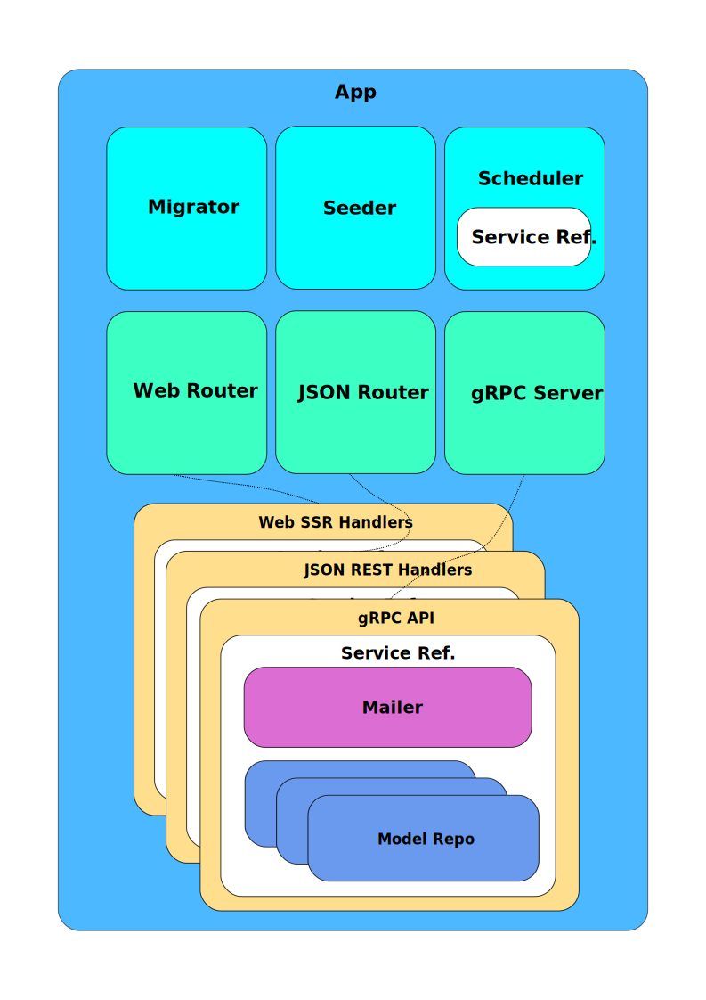

# Description

**Application** basically integrates the following components.



## Migrator

Manage creation and update of new tables, views and indexes.
The formal way to create a new migration is to add a
file under `internal/mig` directory.
Currently there are three migrations files that you can use as a reference to create new ones.

```shell
├── 00001createuserstable.go
├── 00002createeventstable.go
├── 00003createticketstable.go
├── mig.go
└── step.go
```

Each of these files defines two functions with the following structure.

**Sample 00004createxxxxxtable.go**

```go`
package mig

func (s \*step) CreateXXXXXTable() error {
tx := s.GetTx()

    st := `CREATE TABLE xxxxx
    (
    	id UUID PRIMARY KEY,
    	col_1 INTEGER,
    	col_2 VARCHAR(32) UNIQUE,
    	col_n TIMESTAMP,
    );`

    _, err := tx.Exec(st)
    if err != nil {
    	return err
    }

    return nil

}

// DropXXXXXTable rollback
func (s \*step) DropXXXXXTable() error {
tx := s.GetTx()

    st := `DROP TABLE xxxxx;`

    _, err := tx.Exec(st)
    if err != nil {
    	return err
    }

    return nil

}

````

Later you need to append these functions as migrations steps in `internal/mig/mig.go`

```go
// GetMigrator configured.
func (m *Migrator) addSteps() {
	// Migrations

  // Intentionally omitted for clarity

	// Create xxxxx table
	s = &step{}
	s.Config(s.CreateXXXXXTable, s.DropXXXXXTable)
	m.AddMigration(s)
}
````

Next time you run the application it will be executed and register in migrations table.

## Seeder

Works in the same way as the migrator.
First you create a file under `internal/seed`

```shell
├── 00001users.go
├── 00002tickets.go
├── 00002xxxxxs.go
├── seed.go
└── step.go
```

And you add these steps in `internal/seed/seed.go`

```go
// GetSeeder configured.
func (s *Seeder) addSteps() {
	// Seeds

  // Intentionally omitted for clarity

  // Events and tickets
	st = &step{}
	st.Config(st.XXXXX)
	s.AddSeed(st)
}
```

Unlike the migrator, seeding process currently is only executed the first time the application is launched. In following restarts it will verify that base users have been created and if it finds them it does not try to execute the operation again.

It is planned to update its operation so that it also keeps a record of applied seedings in a way that allow it to detect those that are still pending.

## Scheduler

Used to execute recurring processes in a similar fashion to [cron](https://en.wikipedia.org/wiki/Cron)

Actually it implements two runners but it is trivial to add new ones if required.

Both are configured through envvars that are read when whe application is launched.

```shell
# Scheduler
export BLT_SCHEDULER_CRON_ONE_STR="* * * * *"
export BLT_SCHEDULER_CRON_TWO_STR="0 * * * *"
```

We have not talked about **Service** yet but the scheduler has a reference to this component which allows it to easily invoke any function in the same way that the endpoints or the gRPC server could also do it.

In the case of this application, it performs two fundamental operations:

- It periodically invoke the action that cancels the ticket reservations that exceeded the maximum time of 15 minutes within which they must be confirmed.
- Periodically call the function that updates currency rates cache using data from [https://api.exchangeratesapi.io](https://api.exchangeratesapi.io/latest)

## Service

All app features are delivered through the Service.
Regardless of whether the action is initiated from a browser through a standard HTML interface, a mobile application using JSON REST API or some microservice communicating through gRPC. Scheduler, as discussed above, can also use all exposed functionality by Service.

## Mailer

In the current implementation it is only used to send confirmation emails after signup but could be attached to the service to send mails when convenient (i.e.: payment confirmation, new events, etc...)

Delivery is done through [Amazon SES](https://aws.amazon.com/ses/) or [Sendgrid](https://sendgrid.com/) but it is easy to add any other like traditional SMTP gateway.

## Web Router, JSON REST Router and gRPC

Expose _Service_ functionality through different mechanisms.

Everything related to these three access strategies is implemented under `pkg` dir (web, json and grpc).

In the current state of development, web access allows a light user administration, authentication, some basic authorization (in progres) and user signup.

JSON REST API is not implemented.

gRPC currently allows to invoke the required functions as described in project documentation.

## Repos

Finally repos (user, event and ticket) are associated to the service to provide a standardized access interface to persistence mechanism.

In the current implementation these interfaces have been implemented to interact with a PostgreSQL database (`internal/repo/pg`). In an initial stage of development, a basic in-memory volatile implementation of repos has also been used as a simple mock mechanism (`internal/repo/vol`).

## Finally

Unit and integration tests will be implemented to verify app correct operation.

Client will also allow to accept arguments (flags) that will act as commands and invocation parameters to gRPC server.
